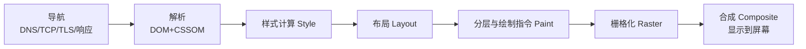

# 网页渲染原理

网页的渲染过程可以概括为HTML文件（包含HTML标签、CSS样式以及JavaScript代码）被处理、渲染为画面的过程。现代浏览器采用多进程架构，渲染由渲染进程主导，其他进程协同配合。

## 一、涉及的进程（进程间分工）

Chromium采用多进程架构，包含浏览器进程、渲染进程、网络进程、GPU进程、插件进程等。这样设计的好处：

- **故障隔离**：某个标签页崩溃不影响其他标签页和浏览器本身；
- **安全性**：渲染进程和插件进程运行在沙箱中，即使页面存在恶意代码也难以攻击操作系统；
- **性能**：各进程可充分利用多核CPU并行工作，响应更快。

**浏览器进程（Browser Process）**

浏览器的"大管家"，负责地址栏、书签、前进后退等界面交互，管理各进程的创建销毁，把用户输入（URL、点击、滚动等）转发给对应进程。

**网络进程（Network Process）**

负责发起网络请求（HTML、CSS、JS、图片等资源）、管理HTTP缓存、处理协议及响应数据。收到响应后，通过IPC将数据传递给渲染进程。

**渲染进程（Renderer Process）**

渲染的核心，每个标签页（或站点隔离下的每个站点）通常对应一个独立渲染进程。内部运行排版引擎（如Blink），负责解析HTML、构建DOM树、计算样式、布局、绘制以及执行JavaScript。

**GPU进程（GPU Process）**

整个浏览器唯一，处理与GPU相关的任务：栅格化结果合成、纹理上传、图像解码等。多个标签页共享这一个进程，利用硬件加速优化图形性能。

## 二、渲染进程内的线程（重点）

**主线程**

渲染进程中最重要的线程，负责解析HTML、构建DOM树、计算样式（Style）、布局（Layout）、生成绘制指令（Paint）以及执行JavaScript。它还处理用户输入事件（点击、滚动事件派发等）。渲染的关键路径几乎都在主线程上，因此JS执行和样式布局计算会阻塞渲染——这也是性能优化的核心关注点。

**合成线程（Compositor Thread）**

独立于主线程运行。接收主线程产出的绘制指令，将图层（Layer）划分为图块（Tile），调度栅格化任务，最后把栅格化结果合成一帧提交给GPU进程显示。因为它不经过主线程，所以**滚动、transform/opacity动画即使主线程繁忙也能流畅进行**（合成器线程动画）。

**栅格化线程（Raster Threads）**

渲染进程内可有多个，负责把图块真正转换为位图（栅格化）。部分栅格化工作会委托给GPU进程完成。

**Worker线程**

包括Web Worker、Service Worker等，在独立的后台线程运行JavaScript代码，不阻塞主线程。常用于执行计算密集型任务、处理离线缓存或推送通知等，与主线程通过消息传递通信。

## 三、辅助机制

**预加载扫描器（Preload Scanner）**

不是独立线程，而是HTML解析的辅助机制：当主线程被`<script>`等阻塞时，它会继续扫描原始HTML中后续的资源引用（\、\<link>、\<script>等），提前向网络进程发起请求，从而充分利用带宽、加快页面加载速度。

## 四、进程/线程协作关系

```
用户输入URL
  → 浏览器进程（处理输入、UI）
  → 网络进程（请求资源）--IPC--> 渲染进程
渲染进程内部：
  主线程：解析 → 样式 → 布局 → 绘制指令
  → 合成线程：分层 → 分块 → 调度栅格化
  → 栅格化线程/GPU进程：生成位图 → 合成一帧 → 屏幕
```

# 网页的渲染过程

整体流程：**导航 → 解析 → 渲染流水线（布局 → 绘制 → 合成）**



## 1.导航（Navigation）：从URL到收到响应

用户在地址栏输入URL后，浏览器进程的UI线程判断这是输入还是搜索，随后通过**网络进程**发起请求。

### （1）检查缓存

真正的第一步是查缓存（按强缓存 → 协商缓存的顺序）：

- **强缓存**：`Cache-Control: max-age` / `Expires` 未过期，直接使用本地资源，不发请求；
- **协商缓存**：过期后携带 `If-None-Match`（对应 `ETag`）或 `If-Modified-Since`（对应 `Last-Modified`）询问服务器，未变化返回 `304`，继续使用本地资源。

### （2）DNS查询

- 域名解析为IP地址，查询顺序：**浏览器DNS缓存 → 系统DNS缓存（hosts文件）→ 路由器缓存 → 本地DNS服务器（递归查询）→ 根/顶级域/权威域名服务器（迭代查询）**；
- 传输层：优先UDP，DNS报文过大时用TCP；现代协议为 DNS over HTTPS/TLS；
- 优化：`dns-prefetch`、DNS多路复用、HTTPS中利用已有连接（如HTTPDNS）。

### （3）TCP握手

- 与服务器建立TCP连接，经典为**三次握手**（SYN → SYN+ACK → ACK），确认双方收发能力；
- 现代浏览器对HTTPS站点优先使用 **QUIC（HTTP/3，基于UDP）**，将传输与加密握手合并，减少往返延迟。

### （4）TLS协商

- HTTPS需要协商加密参数：**TLS 1.2** 需要2-RTT（ClientHello/ServerHello + 密钥交换），**TLS 1.3** 优化为 **1-RTT**，且支持 0-RTT 会话恢复；
- 协商内容：协议版本、加密套件、验证证书、生成会话密钥。之后的HTTP报文都会被加密。

### （5）发送请求与接收响应

- 发送HTTP请求，服务器返回HTML文档（状态码、响应头、响应体）；
- 网络进程检查响应头：若是HTML，将数据通过**IPC**流式转发给对应**渲染进程**的主线程开始解析（导航阶段与解析阶段可并行）；若是下载文件，则交给下载管理器；
- 连接复用：HTTP/1.1 keep-alive、HTTP/2多路复用，避免后续资源重复握手。

## 2.解析（Parsing）：HTML文本 → DOM/CSSOM

渲染进程主线程收到HTML数据后开始解析。

### （1）构建DOM树

- 解析器将字节流 → 字符 → Token → **节点** → **DOM树**，是**增量解析**：边接收数据边解析，无需等整个文档下载完；
- 预加载扫描器（Preload Scanner）并行工作：主线程被阻塞时它继续扫描后续资源（\、\<link>、\<script>等），提前发起请求；
- 令牌化过程中的容错：浏览器对不规范HTML有容错机制（如自动补全\<tbody>、嵌套错误纠正）。

**JS对解析的影响（重点）：**

- `<script>`（无属性）：脚本**下载+执行都会阻塞HTML解析**——因为JS可能修改DOM（`document.write`），必须等脚本执行完才能继续解析；且若脚本访问了未解析的CSS（如`getComputedStyle`），还会等待CSSOM构建完成；
- `<script async>`：**下载不阻塞解析，下载完立即执行（执行时阻塞解析）**，执行顺序不确定，适合无依赖的独立脚本（如统计脚本）；
- `<script defer>`：**下载不阻塞解析，在DOM解析完成后、`DOMContentLoaded`事件前按顺序执行**，适合依赖完整DOM的脚本；
- `<script type="module">`：默认行为类似defer。

### （2）构建CSSOM树

- 解析器遇到`<link rel="stylesheet">`或`<style>`时，将CSS解析为**CSSOM树**：字节 → 字符 → Token → 规则节点 → 树；
- CSSOM构建具有**层层依赖**性：浏览器必须遍历完所有规则才能确定最终样式，且后面规则可能覆盖前面（层叠），因此**CSS是阻塞渲染的资源**——CSSOM未构建完成时，浏览器不会渲染任何内容（白屏），但**不阻塞DOM解析**；
- 注意：JS执行可能依赖CSSOM（读取样式），所以`<link>`在`<script>`之前还会间接阻塞JS执行；
- 优化：媒体查询可拆分（`media="print"`不阻塞首屏渲染）、减少关键CSS体积、内联首屏关键CSS。

### （3）构建渲染树（布局树）

- DOM树 + CSSOM树 → **渲染树/布局树（Layout Tree）**：为每个可见节点创建布局对象（LayoutObject）；
- 遍历规则：
  - `display: none` 的节点**不生成**布局对象（不在渲染树中）；
  - `visibility: hidden` / `opacity: 0` 的节点**生成**布局对象（占位但不可见）；
  - `\<head>`、`\<meta>`等不可见标签不生成；
- **伪元素**（`::before`等）不在DOM中，但会生成布局对象加入渲染树；
- 注意：Chrome中布局树在后续布局阶段才真正生成，此处可理解为"哪些内容要渲染"的准备阶段。

### （4）JS与DOM的交互时机

- `DOMContentLoaded`：DOM解析完成（含defer脚本执行）后触发，**不含**等待async脚本和图片等资源；
- `load`：所有资源（图片、async脚本、iframe等）加载完成后触发；
- 渲染进程主线程解析完成，`document.readyState` 变为 `"interactive"` → `"complete"`。

## 3.渲染流水线：从布局树到屏幕像素

> 这是Chrome渲染管线的现代描述，对应高频面试题"从输入URL到页面显示"的后半段。

### （1）布局（Layout）：计算几何信息

- 遍历布局树，递归计算每个节点的**几何信息**：精确的位置（x、y）和大小（width、height），产出布局树（LayoutTree，含Fragment等内部结构）；
- 布局结果受视口（viewport）影响：改变窗口大小会触发重新布局；
- **重排（Reflow/回流）**：任何影响几何信息的变更（尺寸、位置、增删节点）都会导致重排。重排是**全局性的**——一个节点变化可能引起整棵树重新计算，代价最高。

### （2）分层与绘制（Paint）：生成绘制指令

- 主线程遍历布局树，**更新层叠上下文与属性树**，确定哪些元素需要**单独分层（Compositing Layer）**，如：
  - 有3D transform、will-change、fixed定位的元素；
  - 带`transform/opacity`动画的元素；
  - 视频canvas等；
- 为每个层生成**绘制指令列表（Display List / Paint Ops）**，如"在(x,y)画一个蓝色矩形"——**现代Chrome的Paint阶段只是记录指令，并不真正画出像素**；
- **重绘（Repaint）**：只影响外观（颜色、背景、阴影）不影响几何的变更，跳过Layout，直接重新生成绘制指令，比重排代价小。

### （3）合成（Composite）：栅格化与显示

- 主线程将绘制指令和分层结果**提交给合成线程**（这一步是主线程和合成线程的分工点），之后主线程可继续响应JS和输入；
- 合成线程的工作：
  1. **分块（Tiling）**：将图层划分为图块（Tile，如256×256或512×512），优先栅格化视口附近的图块；
  2. **栅格化（Raster）**：将图块指令通过GPU进程转换为**位图**（GPU加速时部分栅格化在GPU完成）；
  3. **生成合成帧**：将栅格化后的图块按照属性树变换（位置、缩放、滚动偏移）合成一帧，通过IPC提交给**GPU进程**；
- GPU进程将合成帧绘制到屏幕；
- **合成器线程动画（Compositor-only Animation）**：`transform`和`opacity`动画可完全由合成线程驱动，**即使主线程被JS阻塞，动画依然流畅**——这是性能优化的根本依据（优先用transform代替top/left动画）。

## 4.渲染性能：重排、重绘与合成

| 操作 | 是否触发Layout | 是否触发Paint | 代价 | 典型属性 |
| --- | --- | --- | --- | --- |
| 重排（Reflow） | ✅ | ✅ | 最高 | width、height、top/left、font-size |
| 重绘（Repaint） | ❌ | ✅ | 中 | color、background、box-shadow |
| 合成（Composite） | ❌ | ❌ | 最低 | transform、opacity |

**优化原则：**

1. 优先使用`transform`和`opacity`做动画，只触发合成；
2. 批量修改DOM：使用`DocumentFragment`、或将读写分离（避免"布局抖动"Layout Thrashing——交替读写`offsetHeight`等几何属性会强制同步重排）；
3. 频繁重排的元素使用`position: absolute/fixed`使其脱离文档流；
4. JS长任务会阻塞主线程，用`requestAnimationFrame`在下一帧渲染前执行视觉变更，`requestIdleCallback`处理低优先级任务，Web Worker处理计算密集型任务；
5. 避免频繁触发重排的读写模式：如循环中读取`offsetWidth`后立即修改样式。
